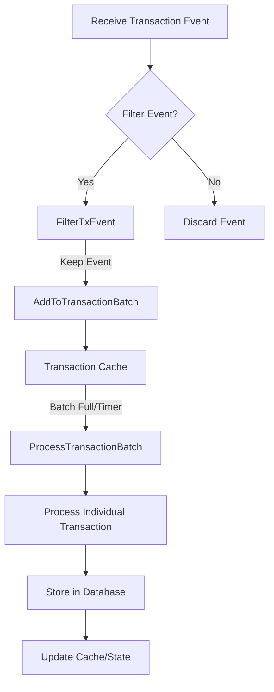

# Indexer Internal Workings

This document describes the internal data flow of the Andamio Indexer, focusing on how transactions are received, processed, and stored.

## Data Flow

The indexer processes transactions through a series of steps, starting from receiving transaction events and ending with storing the relevant data in the database. The key components involved and their interactions are illustrated in the diagram below:

### Component Descriptions

*   **Receive Transaction Event:** The indexer listens for and receives transaction events from the blockchain.
*   **Filter Event (`FilterTxEvent`):** Received transaction events are passed through a filter to determine if they are relevant to the addresses or policies being tracked by the indexer.
*   **Add to Transaction Batch (`AddToTransactionBatch`):** Relevant transaction events are added to a batch. This helps in processing transactions in groups, improving efficiency.
*   **Transaction Cache:** A cache (`TransactionCache`) is used to temporarily store transaction events before they are processed in batches.
*   **Process Transaction Batch (`ProcessTransactionBatch`):** When a batch is full or a timer expires, the batched transactions are processed.
*   **Process Individual Transaction:** Each transaction within a batch is processed individually to extract relevant information.
*   **Store in Database:** The extracted and processed transaction data is stored in the database. The indexer interacts with the database layer to persist the data.
*   **Update Cache/State:** After successful storage, the indexer's internal cache and state are updated to reflect the newly indexed data.
*   **Discard Event:** Transaction events that do not pass the filter are discarded.

This flow ensures that only relevant transactions are processed and stored, optimizing the indexer's performance and storage usage.